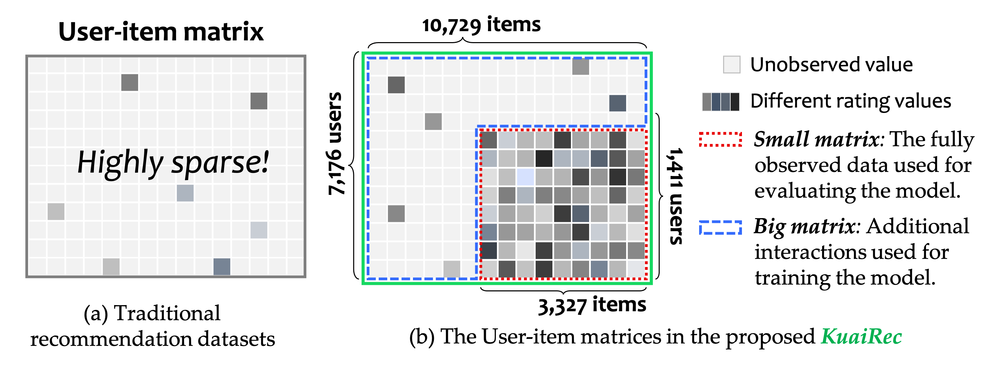

[](https://github.com/chongminggao/KuaiRec/blob/main/LICENSE)

*KuaiRec* is a real-world dataset collected from the recommendation logs of the video-sharing mobile app [Kuaishou](https://www.kuaishou.com/cn). For now, it is the first dataset that contains a fully observed user-item interaction matrix. For the term "fully observed", we mean there are almost no missing values in the user-item matrix,  i.e., each user has viewed each video and then leaved feedback. 

The following figure illustrates the user-item matrices in traditional datasets and *KuaiRec*.



With all user's preference known, KuaiRec can used in offline evaluation (i.e., offline A/B test) for recommendation models. It can benefit lots of research directions, such as unbiased recommendation, interactive/conversational recommendation, or reinforcement learning (RL) and off-policy evaluation (OPE) for recommendation.

If you use it in your work, please cite our paper:
 [](https://arxiv.org/abs/2202.10842) [](https://arxiv.org/pdf/2202.10842.pdf)

>@article{gao2022kuairec,
> title={KuaiRec: A Fully-observed Dataset for Recommender Systems}, 
> author={Chongming Gao and Shijun Li and Wenqiang Lei and Biao Li and Peng Jiang and Jiawei Chen and Xiangnan He and Jiaxin Mao and Tat-Seng Chua},
> year={2022},
> journal={arXiv preprint arXiv:2202.10842},
> primaryClass={cs.IR}
>}


[This repository](https://github.com/xiwenchao/fully_observed_demo) lists the example codes in evaluating conversational recommendation as described in the paper.

We provide some simple statistics of this dataset [here](https://chongminggao.github.io/KuaiRec/Statistcs_KuaiRec.html) . It is generated by [Statistcs_KuaiRec.ipynb](https://github.com/chongminggao/KuaiRec/blob/main/Statistcs_KuaiRec.ipynb). You can do it online at Google Colab [](https://colab.research.google.com/github/chongminggao/KuaiRec/blob/main/Statistcs_KuaiRec.ipynb).

---

## Download the data

We provides several options to download this dataset:

  Option 1. Download via the "wget" command.

```shell
 wget https://chongming.myds.me:61364/data/KuaiRec.zip --no-check-certificate
 unzip KuaiRec.zip
```
  Option 2. Download manually through the following links:

  - Optional link 1: [Google Drive](https://drive.google.com/file/d/1qe5hOSBxzIuxBb1G_Ih5X-O65QElollE/view?usp=sharing)

  - Optional link 2: [USTC Drive](https://rec.ustc.edu.cn/share/9a5a3040-93c0-11ec-9384-0bd461127fcd)

The script `loaddata.py` provides a simple way to load the data via Pandas in Python.

---

## Data Descriptions

*KuaiRec* contains millions of user-item interactions as well as the side information include the item categorires and social network. Four files are included in the download data: 

  ```shell
  KuaiRec
  ├── data
  │   ├── big_matrix.csv          
  │   ├── small_matrix.csv
  │   ├── social_network.csv
  │   └── item_categories.csv
  ```

The statistics of the small matrix and big matrix in *KuaiRec*.

|                | #Users | #Items | #Interactions | #Attributes of items | #Users who have friends | Density |
| -------------- | :----: | :----: |  :----: | :------------------: | :---------------------: | :-----: |
| *small matrix* | 1,411  | 3,327  | 4,676,570 |          31          | 146 |  99.6%  |
| *big matrix*   | 7,176  | 10,729 | 12,530,806 |          31          | 472 | 13.4% |

Note that the density of small matrix is 99.6% instead of 100% because some users have explicitly indicated that they would not be willing to receive recommendations from certain authors. I.e., They blocked these videos.

#### 1. Descriptions of the fields in `big_matrix.csv` and `small_matrix.csv`. 

| Field Name:    | Description                                              | Type    | Example                   |
| -------------- | -------------------------------------------------------- | ------- | ------------------------- |
| user_id        | The ID of the user.                                      | int64   | 0                         |
| video_id       | The ID of the viewed video.                              | int64   | 3650                      |
| play_duration  | Time of video viewing of this interaction (millisecond). | int64   | 13838                     |
| video_duration | Time of this video (millisecond).                        | int64   | 10867                     |
| time           | Human-readable date for this interaction                 | str     | "2020-07-05 00:08:23.438" |
| date           | Date of this interaction                                 | int64   | 20200705                  |
| timestamp      | Unix timestamp                                           | float64 | 1593878903.438            |
| watch_ratio    | The video watching ratio (=play_duration/video_duration) | float64 | 1.273397                  |

The "watch_ratio" can be deemed as the label of the interaction. Note: there is no "like" signal for this dataset. If you need this binary signal in your scenarios, you can create it yourself. E.g., `like = 1 if watch_ratio > 2.0`.

#### 2. Descriptions of the fields in `social_network.csv`

| Field Name: | Description                                 | Type  | Example     |
| ----------- | ------------------------------------------- | ----- | ----------- |
| user_id     | The ID of the user.                         | int64 | 5352        |
| friend_list | The list of ID of the friends of this user. | list  | [4202,7126] |

#### 3. Descriptions of the fields in `item_categories.csv`. 

| Field Name: | Description                     | Type  | Example |
| ----------- | ------------------------------- | ----- | ------- |
| video_id    | The ID of the video.            | int64 | 1       |
| feat        | The list of tags of this video. | list  | [27,9]  |